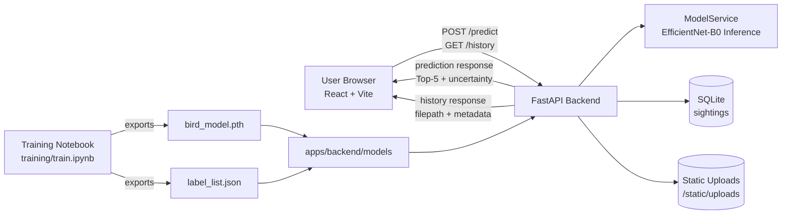

# BirdDetection Architecture

This document explains the end-to-end architecture of the BirdDetection monorepo, including training, inference, frontend UX, data flow, and operational workflows.

## 1) System Overview

BirdDetection is a hybrid monorepo with three main runtime domains:

- **ML Training** (`training/`): builds model artifacts from CUB-200-2011.
- **Backend API** (`apps/backend/`): serves predictions and sighting history.
- **Frontend Dashboard** (`apps/frontend/`): user-facing web app for uploads and history.

Supporting governance/docs are under `conductor/`.

## 2) Repository Structure

- `apps/backend/`
  - FastAPI app (`app/main.py`)
  - Model service (`app/inference.py`)
  - DB/session/models/schemas
  - Local static uploads (`static/uploads/`)
  - Tests (`tests/`)
- `apps/frontend/`
  - React + Vite + TypeScript
  - TanStack Router routes (`Dashboard`, `History`)
  - API client and UI components
- `training/`
  - `train.ipynb` for dataset bootstrap, training, and artifact export
- `conductor/`
  - Product/workflow/tracks planning and implementation checkpoints
- Root
  - `Makefile` (`install`, `dev`, `check`)
  - uv workspace config (`pyproject.toml`)

## 3) High-Level Component Architecture

```text
User Browser (React/Vite)
   |
   | HTTP (upload/history)
   v
FastAPI Backend
   |-- ModelService (PyTorch EfficientNet-B0)
   |-- SQLite (sightings table)
   |-- Static Files (/static/uploads)
   |
   +-- Reads artifacts from apps/backend/models/
          ^
          |
     Training Notebook exports:
     - bird_model.pth
     - label_list.json
```

### Mermaid Diagram



## 4) Training Architecture (`training/train.ipynb`)

### Dataset + preprocessing

- Source dataset: **CUB-200-2011**.
- Notebook downloads/extracts dataset if missing.
- Parses metadata files:
  - `images.txt`
  - `image_class_labels.txt`
  - `classes.txt`
- Uses a stratified train/validation split (80/20).
- Image pipeline:
  - Resize to `224x224`
  - RGB conversion
  - ImageNet normalization

### Model

- Base architecture: **EfficientNet-B0** with ImageNet pretrained weights.
- Final classifier head replaced for **200 classes**.

### Artifacts

- Produces:
  - `bird_model.pth` (best checkpoint)
  - `label_list.json` (class labels)
  - `training_metrics.json` (best/target accuracy report)
- Copies model artifacts into:
  - `apps/backend/models/`

## 5) Backend Architecture (`apps/backend/`)

### Runtime and startup

- Framework: **FastAPI**.
- Startup lifecycle initializes:
  - DB schema (`Base.metadata.create_all`)
  - model + labels via `ModelService.load()`

### Inference service (`app/inference.py`)

- Encapsulates model loading and prediction.
- Applies the same inference preprocessing used by training assumptions.
- Returns Top-5 predictions with probabilities.

### API surface

- `GET /health`
  - Returns service status + model readiness.
- `POST /predict`
  - Accepts uploaded image (`UploadFile`)
  - Validates image MIME/payload and size limits
  - Stores image in `static/uploads/`
  - Runs Top-5 inference
  - Persists top result in SQLite
  - Applies uncertainty rule (`top_probability < 0.30`)
- `GET /history`
  - Returns stored sightings (latest first)
- `GET /images/{filename}`
  - Returns static URL helper for uploaded files

### Persistence

- DB: **SQLite** (`bird_sightings.db` in backend folder).
- Main table: `sightings`
  - `id`
  - `filepath`
  - `top_species`
  - `probability`
  - `timestamp`
  - `is_uncertain`

### Static files

- FastAPI mounts `/static` to backend `static/` folder.
- Uploaded images are stored and served from `/static/uploads/...`.

## 6) Frontend Architecture (`apps/frontend/`)

### Stack

- **React 18** + **Vite** + **TypeScript**
- **TanStack Router** for route management
- Tailwind-based UI utilities/components

### Route structure

- `/` → `DashboardPage`
  - drag-and-drop uploader
  - preview image
  - submit to `/predict`
  - show Top-5 table
  - show uncertainty warning when `is_uncertain = true`
- `/history` → `HistoryPage`
  - fetches `/history`
  - renders cards with image, species, confidence, timestamp

### API integration

- Frontend API base URL:
  - `VITE_API_BASE_URL` (from `.env`)
  - fallback `http://localhost:8000`
- All backend communication is via simple HTTP fetch calls.

## 7) End-to-End Data Flow

1. User drops/selects an image in Dashboard.
2. Frontend sends multipart upload to `POST /predict`.
3. Backend validates + saves file.
4. Backend runs model inference (Top-5).
5. Backend stores top prediction metadata in SQLite.
6. Backend returns response with Top-5, top species, probability, uncertainty, filepath.
7. Frontend renders results and warning state if uncertain.
8. On History page, frontend fetches `GET /history` and renders persisted sightings.

## 8) Cross-Cutting Rules and Contracts

- **Uncertainty contract**: `is_uncertain = true` when top probability is `< 0.30`.
- **CORS policy**: backend allows frontend origin `http://localhost:5173`.
- **Artifact contract**:
  - backend expects `apps/backend/models/bird_model.pth`
  - backend expects `apps/backend/models/label_list.json`
- **Validation gates**:
  - backend lint/tests
  - frontend lint/typecheck
  - unified through `make check`

## 9) Development and Quality Workflow

### Install

- `make install`
  - `uv sync` for backend/training workspace deps
  - `bun install` for frontend deps

### Run locally

- `make dev`
  - starts backend (`uvicorn`) and frontend (`vite`) together

### Validate

- `make check`
  - backend: `ruff check .` + `pytest -q`
  - frontend: `eslint` + `tsc --noEmit`

## 10) Security and Reliability Notes

- Uploads are validated by MIME prefix and image decode verification.
- Upload size has a hard limit in backend.
- Model unavailability returns explicit `503` guidance.
- Local SQLite + filesystem storage are suitable for local/single-node usage.

## 11) Known Evolution Paths

Potential next architecture improvements:

- Async/background inference queue for heavy workloads.
- Object storage (instead of local filesystem) for uploaded images.
- Postgres for multi-user/scalable persistence.
- Structured observability (metrics/tracing/log aggregation).
- Model versioning and rollback strategy.

---

